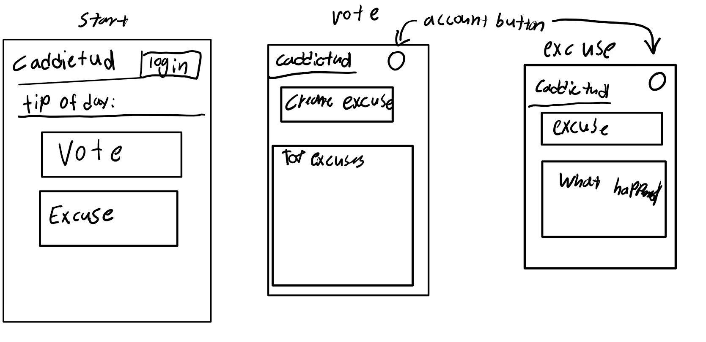

# Caddietud

[My Notes](notes.md)

Caddietud will be a web application that uses users to get excuses that depending on tags like "help my ball went into the water". Another feature is to allow users to generate their own excuses and vote on who has the best excuse.

## 🚀 Specification Deliverable

For this deliverable I did the following. I checked the box `[x]` and added a description for things I completed.

- [x] Proper use of Markdown
- [x] A concise and compelling elevator pitch
- [x] Description of key features
- [x] Description of how you will use each technology
- [x] One or more rough sketches of your application. Images must be embedded in this file using Markdown image references.

### Elevator pitch

Have you ever played a round of golf with friends and missed the green by a mile. Well be not afraid of because Caddietud is here to save you. Caddietud is a web application that will help you get out of the ruff by giving the funniest excuses. But that's not all if you think you can do better than our app you can create your own excuse and upload it to Caddietud. You and your friends can vote on who has the funniest excuse.

### Design

### Key features

- Allows the user to prompt an ai to create an excuse about their current situation
- Users can create their own excuse and upload it to the website
- Users have the option to vote on who has the best excuse

### Technologies

I am going to use the required technologies in the following ways.

- **HTML** - I'm going to use HTML to design the structure of the web-page
- **CSS** - Used to give the structure of the web-page a more modern function and feel
- **React** - used for login screen into the app and managing what users user input and what users see when they vote
- **Service** - Backend serves like loggin, logging votes, and managing all of the excuses uploaded by users
- **DB/Login** - Stores user data like uploaded excuses and votes
- **WebSocket** - Used to update the current vote resaults in real time

## 🚀 AWS deliverable

For this deliverable I did the following. I checked the box `[x]` and added a description for things I completed.

- [x] **Server deployed and accessible with custom domain name** - https://startup.tyler-coombs-portfolio.click

## 🚀 HTML deliverable

For this deliverable I did the following. I checked the box `[x]` and added a description for things I completed.

- [x] **HTML pages** - I added pages for each component of my application
- [x] **Proper HTML element usage** - I used elements in my website
- [x] **Links** - I used links to link to all web pages
- [x] **Text** - has text
- [x] **3rd party API placeholder** - currently not planed to use 3rd party
- [x] **Images** - I added a golfball picture
- [x] **Login placeholder** - there is a login page
- [x] **DB data placeholder** - Has placeholders for server data
- [x] **WebSocket placeholder** - there are placeholders

## 🚀 CSS deliverable

For this deliverable I did the following. I checked the box `[x]` and added a description for things I completed.

- [X] **Header, footer, and main content body** - All pages have this
- [X] **Navigation elements** - making a nav bar is harder than it seems
- [X] **Responsive to window resizing** - I used display:flex to make the windows resizable and tested for mobile screens
- [X] **Application elements** - I used css to make the elements look better
- [X] **Application text content** - used css to make the text look great
- [X] **Application images** - used css to put an image as part of the background on the home page.

## 🚀 React part 1: Routing deliverable

For this deliverable I did the following. I checked the box `[x]` and added a description for things I completed.

- [X] **Bundled using Vite** - Vite is very useful when you want to test your site
- [X] **Components** - Very cool to compartmentalize the webpage also I know that it's faster now
- [X] **Router** - The process in order to insert a new part of the page

## 🚀 React part 2: Reactivity deliverable

For this deliverable I did the following. I checked the box `[x]` and added a description for things I completed.

- [X] **All functionality implemented or mocked out** - I used javascript to emulate adding an excuse to a ranked list. Also for getting an excuse off the server when you press a button
- [X] **Hooks** - I use hooks to set callbacks to update the leaderboard

## 🚀 Service deliverable

For this deliverable I did the following. I checked the box `[x]` and added a description for things I completed.

- [X] **Node.js/Express HTTP service** - Node and express make the whole backend service stuff possible
- [X] **Static middleware for frontend** - On the home page I used this to add the api
- [X] **Calls to third party endpoints** - I found an api that gives random life advice
- [X] **Backend service endpoints** - In the backend the data is now being stored like user info and a list of uploaded excuses
- [X] **Frontend calls service endpoints** - I used this in the voting system to upload and update the leaderboard
- [X] **Supports registration, login, logout, and restricted endpoint** - Now some parts of my site are behind a login screen

## 🚀 DB deliverable

For this deliverable I did the following. I checked the box `[x]` and added a description for things I completed.

- [ ] **Stores data in MongoDB** - I did not complete this part of the deliverable.
- [ ] **Stores credentials in MongoDB** - I did not complete this part of the deliverable.

## 🚀 WebSocket deliverable

For this deliverable I did the following. I checked the box `[x]` and added a description for things I completed.

- [ ] **Backend listens for WebSocket connection** - I did not complete this part of the deliverable.
- [ ] **Frontend makes WebSocket connection** - I did not complete this part of the deliverable.
- [ ] **Data sent over WebSocket connection** - I did not complete this part of the deliverable.
- [ ] **WebSocket data displayed** - I did not complete this part of the deliverable.
- [ ] **Application is fully functional** - I did not complete this part of the deliverable.
